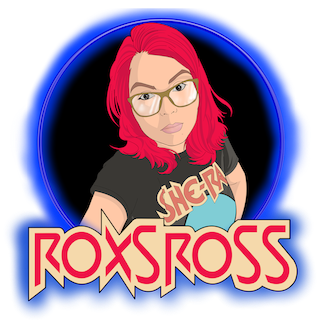
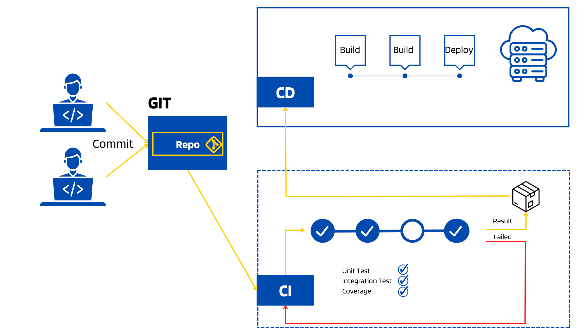

# 295WithRoxs Academy DevOps @2023 Desafío Final 🔥 🔥

### Concepto – ¿Pero qué es DevOps? 
DevOps es un término surgido de la combinación de “desarrollo” y “operaciones” (en inglés development y operations) que representa una cultura con el enfoque colaborativo entre el equipo de (Dev) desarrollo de software y el de (Ops) operación del software. 

En su significado más amplio, DevOps es una cultura. Lo que se quiere conseguir con este tipo de metodología es aumentar la comunicación y confianza entre los desarrolladores y los administradores de sistemas, es decir, integrar los departamentos de operaciones y desarrollo. Utilizamos metodologías ágiles y nos integramos en todas las etapas del ciclo de vida de la aplicación para entregar los productos lo más rápido posible y gestionar todas las incidencias que puedan surgir para hacer las correcciones pertinentes en cada situación. 

🔥 Con DevOps tu despliegue dejará de ser manual, repetitivo y propenso a errores y se volverá automatizado, rápido y seguro.

## **Introducción**:
El **desafío final** es surfear las olas en práctica y desafiar los conocimientos sobre las herramientas tecnológicas y conceptos teóricos aprendidos durante estos meses.
En las clases vimos: Intro DevOps, Git, Docker, Kubernetes, CI/CD, Jenkins, Github Actions, Cloud, Security, etc.

## **Objetivos**:
- Utilizar todo lo aprendido durante el bootcamp
- Proponer y llevar a cabo una solución general a la problemática
- Simular el caso real del ciclo de vida de una aplicación
- La automatización es la clave
- Crear y mantener entornos productivos y no productivos (develop, testing)
- Aprender a utilizar nuevas Tools
- Aprender a trabajar en equipo para resolver dudas o problemáticas

## **Requerimiento:**
La empresa **ZERO Technology**, solicita al Equipo de DevOps Trainer SuperPower 🚀 migrar alguno de sus dos proyectos:
Las opciones presentadas de los dos proyectos: 
- [final-bootcampdevops-ninja-v1](./final-bootcampdevops-ninja-v1/Readme.md)
- [final-bootcampdevops-ninja-v2](/final-bootcampdevops-ninja-v2/Readme.md)

Los proyectos estan formados por servicios (**frontend** y **backends**) el requerimiento apunta a desplegarlo en un cluster de Kubernetes. 

Apuntando a lograr administrar el ciclo de las aplicaciones dentro del cluster de forma transparente y que además se pueda automatizar el deploy desde el repositorio.

## **Arquitectura del Cluster:**
Dentro del cluster se proponen dos **entornos**: uno no productivo (**dev**) y uno productivo (**prod**). Cada entorno debe ser creado y administrado de forma independiente 

Los servicios se van a administrar a partir de manifiestos para desplegar las aplicaciones en kubernetes. 

- Pueden aprovisionar usando minikube ó k3s ó killercoda

> Si la opcion es usar EC2 
### Infra:
- Aprovisionar 3 servidores AWS EC2 con Terraform (server-dev, server-prd)
- Crear los ficheros de terraform + userdata (docker+docker-compose)

## **CICD**
Como plataforma para versionar el código e implementar el CI/CD pipeline se va a utilizar alguna de las siguientes opciones: 
- **Jenkins**
- **Github Actions**
- **Gitlab**
Siguiendo la estrategia de branching por entornos.

## **CICD:**
Se debe configurar un CI/CD pipeline que implemente las siguientes stages básicos:
- Build de la imágen de Dockerfile
- Push de la imágen a DockerHub
- Controlar la version de la aplicacion
- Deploy de la aplicación en algunas de estas opciones:
    - Minikube
    - EC2 (docker-docker-compose)
    - EC2 + k3s

Luego agregar:
- Stage de aprobación manual antes del deploy cuando el entorno al que se va a deployar es producción
- Notificación del resultado del pipeline por Slack/Telegram

## **Arquitectura:**
Realizar un diseño gráfico de las herramientas y servicios que utilizarían si implementaran esta solución en una Cloud (AWS, GCP, Azure, etcétera).

## **Observaciones y recomendaciones:**
- La arquitectura de la aplicación está formada por servicios backends y frontend los cuales deberían tener su propio repositorio.
- Se puede realizar un docker-compose para probar local la aplicación en su conjunto.
- Se puede deployar ingress para frontend, backend para poder utilizar una url configurada en */etc/hosts* ó usando wildcard DNS https://nip.io/ .
- Cada servicio debe tener su dockerfile.
- Documentación

## **Links:**
- [Install Minikube](https://k8s-docs.netlify.app/en/docs/tasks/tools/install-minikube/)
- [Install Postgresql](https://github.com/bitnami/charts/tree/master/bitnami/postgresql)

> Busca los logros donde no hay límites by @roxsross

## Contribuciones

Como siempre, cualquier contribución es bienvenida, simplemente forkeá este repo y enviame una PR.  
