### CHALLENGE FINAL Bootcamp DevOps V2

La empresa ZERO Technology, solicita al Equipo de DevOps Trainer, la contenerizacion de su aplicacion "Products DevOp v2" en la que incluye:

## Arquitectura
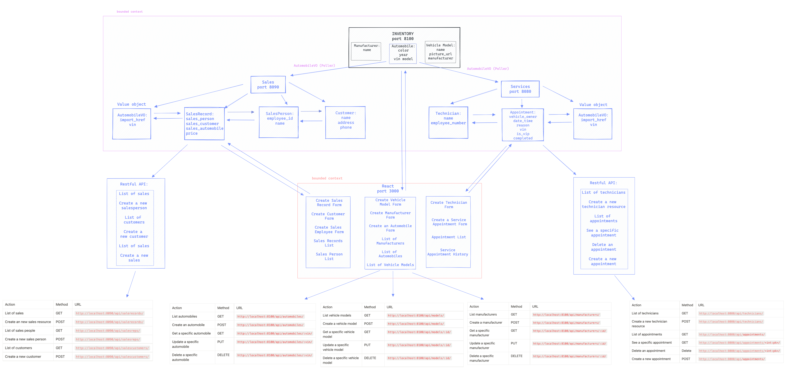

## Instrucciones:
1. Forkear el proyecto desde gitlab repository
2. Open el terminal and cd en la carpeta para del proyecto
    - git clone [_repository link_]
    - cd [_project name_]
3. Ejecute el siguiente comando para abrir la aplicación en Visual Studio Code
    - code .
4. Ejecute los siguientes comandos después de abrir el proyecto en la carpeta deseada:
    - docker volume create beta-data (generates database)
    - docker-compose build (creates the images for the containers)
    - docker-compose up (creates containers and runs them with the respective images)
5. View the application on http://localhost:3000

## PORTS and URL Paths
--------------------------------------------------------------------------------------------
MANUFACTURERS

| Method | URL | Expected Response | PORT

| GET | http://localhost:8100/api/manufacturers/ | List manufacturers | 8100


| POST | http://localhost:8100/api/manufacturers/ | Create a manufacturer |  8100


| GET | http://localhost:8100/api/manufacturers/:id/ | Get a specific manufacturer |8100


| PUT | http://localhost:8100/api/manufacturers/:id/ | Update a specific manufacturer | 8100


| DELETE | http://localhost:8100/api/manufacturers/:id/  | Delete a specific manufacturer | 8100


--------------------------------------------------------------------------------------------
VEHICLE MODELS

| Method | URL | Expected Response | PORT

| GET | http://localhost:8100/api/models/ | List vehicle models | 8100


| POST | http://localhost:8100/api/models/ |Create a vehicle model | 8100


| GET | http://localhost:8100/api/models/:id/ | Get a specific vehicle model | 8100


| PUT | http://localhost:8100/api/models/:id/ |Update a specific vehicle model | 8100


| DELETE | http://localhost:8100/api/models/:id/ | Delete a specific vehicle model | 8100


--------------------------------------------------------------------------------------------
AUTOMOBILES

| Method | URL | Expected Response | PORT

| GET | http://localhost:8100/api/automobiles/ | List automobiles | 8100


| POST | http://localhost:8100/api/automobiles/ | Create an automobile | 8100


| GET | http://localhost:8100/api/automobiles/:vin/ | Get a specific automobile | 8100


| PUT | http://localhost:8100/api/automobiles/:vin/ | Update a specific automobile | 8100


| DELETE | http://localhost:8100/api/automobiles/:vin/ | Delete a specific automobile | 8100


--------------------------------------------------------------------------------------------
SALES MICROSERVICE

| Method | URL | Expected Response | PORT

| GET | http://localhost:8090/api/salerecords/ | List of sales | 8090


| POST | http://localhost:8090/api/salerecords/ | Create an new sales record | 8090


| GET | http://localhost:8090/api/salesreps/ | List of sales people | 8090


| POST | http://localhost:8090/api/salesreps/ | Create a new sales person | 8090


| GET | http://localhost:8090/api/salescustomers/ | List of customers | 8090


| POST | http://localhost:8090/api/salescustomers/ | Create a new customer | 8090


--------------------------------------------------------------------------------------------
SERVICE MICROSERVICE

| Method | URL | Expected Response | PORT

| GET | http://localhost:8080/api/technicians/ | List of technicians | 8080


| POST | http://localhost:8080/api/technicians/ | Create a new technician resource | 8080


| GET | http://localhost:8080/api/appointments/ | List of appointments | 8080


| GET | http://localhost:8080/api/appointments/<int:pk>/ | See specific appointment | 8080


| POST | http://localhost:8080/api/appointments/ | Create a new appointment | 8080


-------------------------------------------------------------------------------------------

### BD Postgres
Usar:
image: postgres:14.2-bullseye

docker exec -it final-bootcampdevops-ninja-v2-database-1 sh

> Then running the psql command in the running container with docker exec -ti NAME_OF_CONTAINER psql -U YOUR_POSTGRES_USERNAME

```
docker exec -it final-bootcampdevops-ninja-v2-database-1 sh
# psql -U service

ver listado tablas \dt
ver contendido \d nombre tabla


```
### Documentacion 

(posrgressql)[https://www.digitalocean.com/community/tutorials/como-instalar-y-utilizar-postgresql-en-ubuntu-16-04-es]

### Adicional 
- Crear Documentación
- Buenas practicas

## Resultados

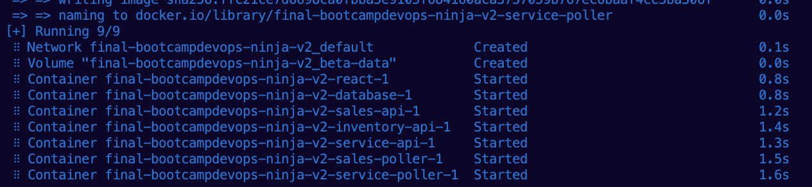
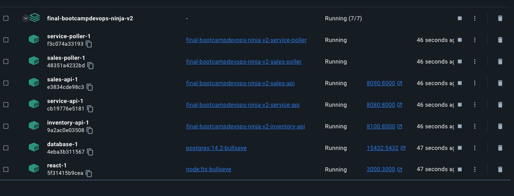
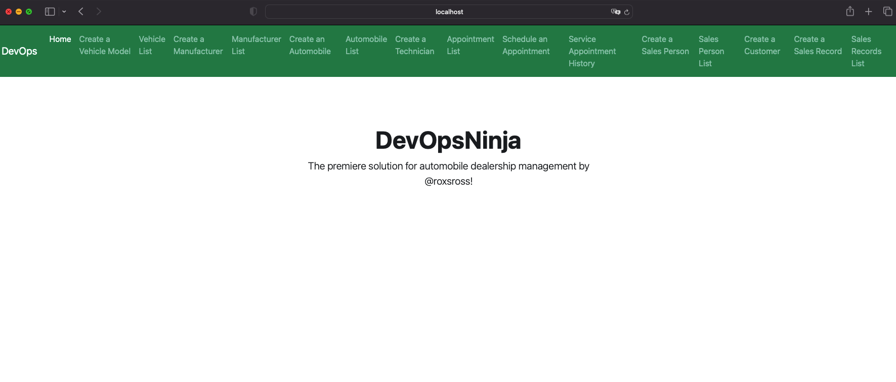
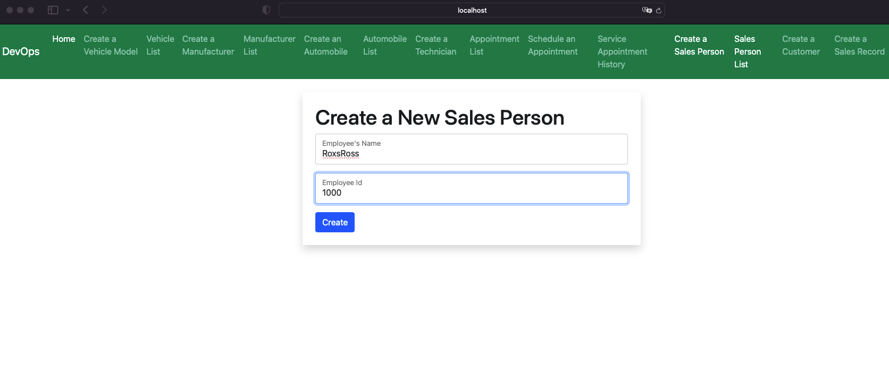
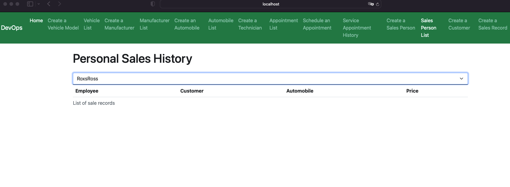
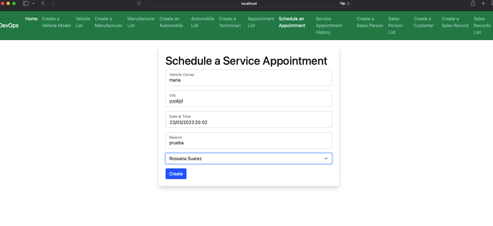
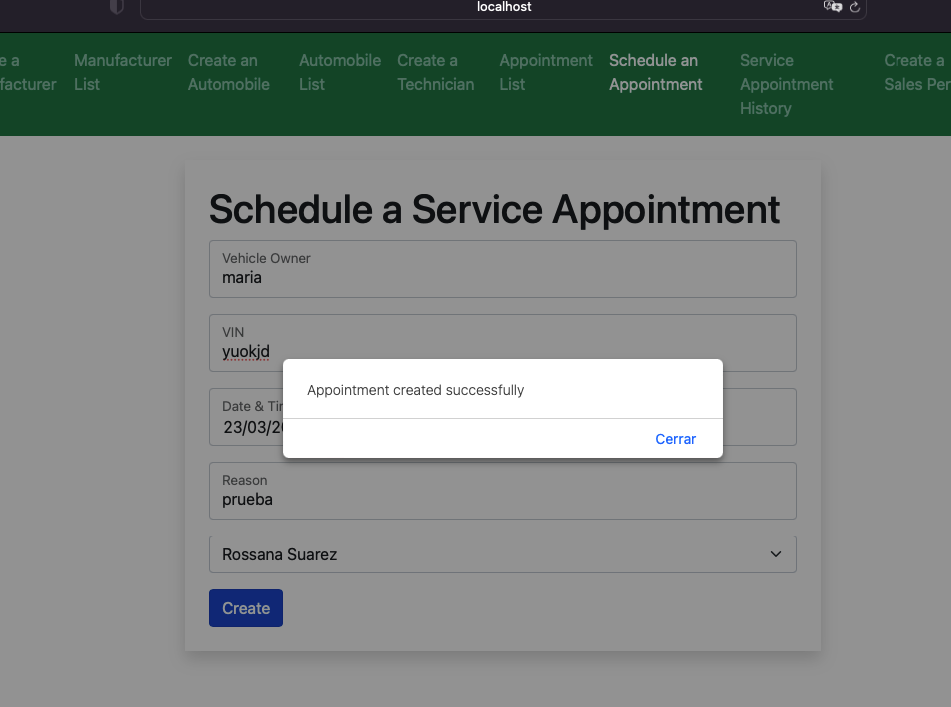
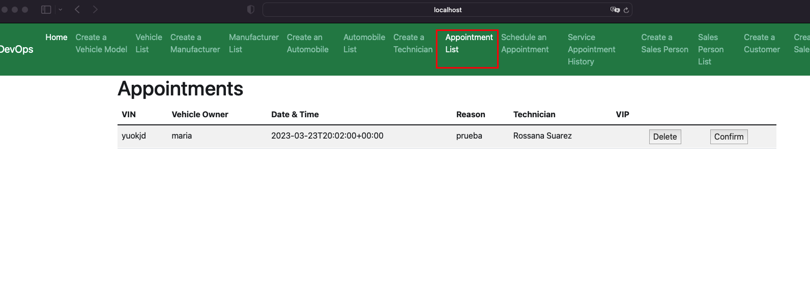
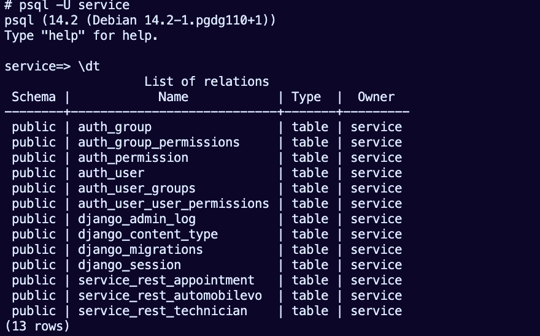
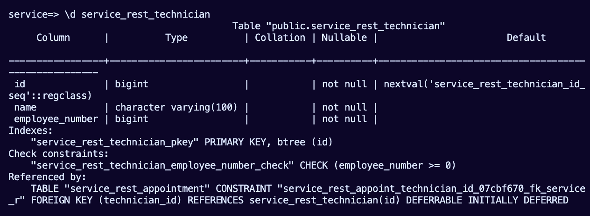
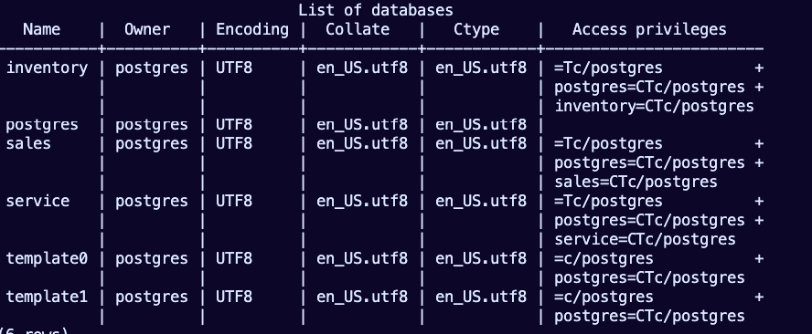
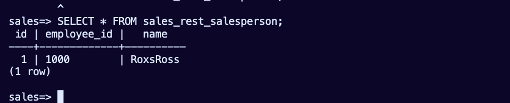
